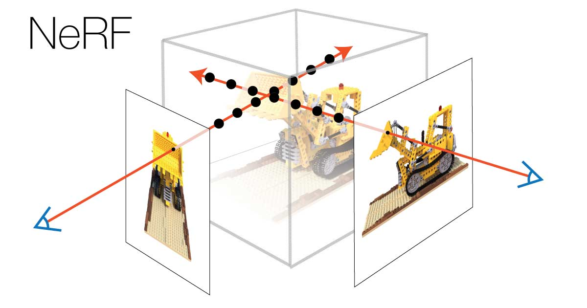

# NeRF: Neural Radiance Fields

  </img>

A simple implementation of the paper [NeRF: Representing Scenes as Neural Radiance Fields for View Synthesis](https://arxiv.org/abs/2003.08934).
We implemented this method for 2D image synthesis and 3D view synthesis. You can find the code and results in [2D NeRF](NeRF2D.ipynb) and [3D NeRF](NeRF.ipynb).

## Resources
- [Yannic Kilcher - NeRF: Representing Scenes as Neural Radiance Fields for View Synthesis (ML Research Paper Explained)](https://www.youtube.com/watch?v=CRlN-cYFxTk)
- [Papers in 100 Lines of Code - NeRF in 100 lines of PyTorch code](https://www.youtube.com/watch?v=Cf63bTpbt0s)
