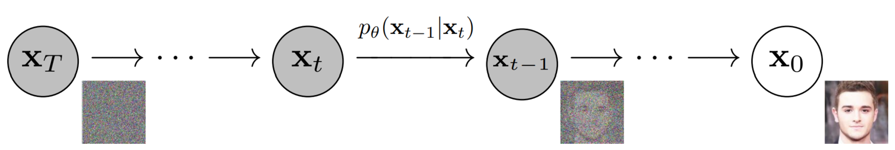

# Denoising Diffusion Probabilistic Models

Implementation of conditional image generation based on [Denoising Diffusion Probabilistic Models](https://arxiv.org/abs/2006.11239). We trained DDPM on MNIST dataset. The code and results are in this [notebook](DDPM.ipynb).

## Resources
- [Outlier - Diffusion Models | Paper Explanation | Math Explained](https://www.youtube.com/watch?v=HoKDTa5jHvg)
- [Outlier - Diffusion Models | PyTorch Implementation](https://www.youtube.com/watch?v=TBCRlnwJtZU)
